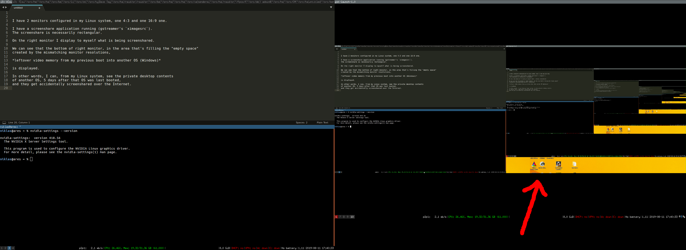

# video-memory-across-reboots

Report of Windows Desktop in video memory surviving all the way into a Linux screenshare application

Click to enhance the screenshot.

## Explanation

I have 2 monitors configured in my Linux system, one 4:3 and one 16:9 one.

I have a screenshare application running (gstreamer's `ximagesrc`).
The screenshare is necessarily rectangular.

On the right monitor I display to myself what is being screenshared.

We can see that the bottom of right monitor, in the area that's filling the "empty space"
created by the mismatching monitor resolutions,
**leftover video memory from my previous boot into another OS (Windows)**
is displayed 🔥.

In other words, from Linux, **I can see the private desktop contents
of another OS, 5 days after that OS was last booted**,
and they get accidentally screenshared over the Internet.

## Should this be happening?

Uninitialised video memory isn't something unheard of, but this seems to go a bit too far.

It appears to me that:

* Windows should wipe desktop contents from video memory when computer reboots, or better when the user logs out
* Linux or the NVIDIA driver should wipe video memory on boot
* Xorg or screen capture applications should capture uninitialised video memory

However, none of these seem to be happening.

Am I missing something? Tell me in an [issue](https://github.com/nh2/video-memory-across-reboots/issues).
